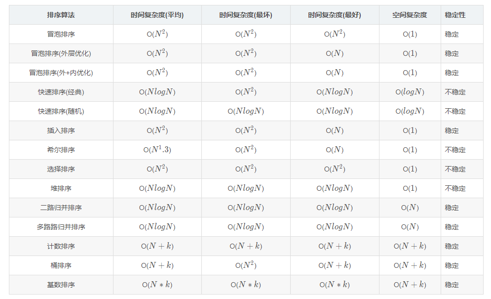
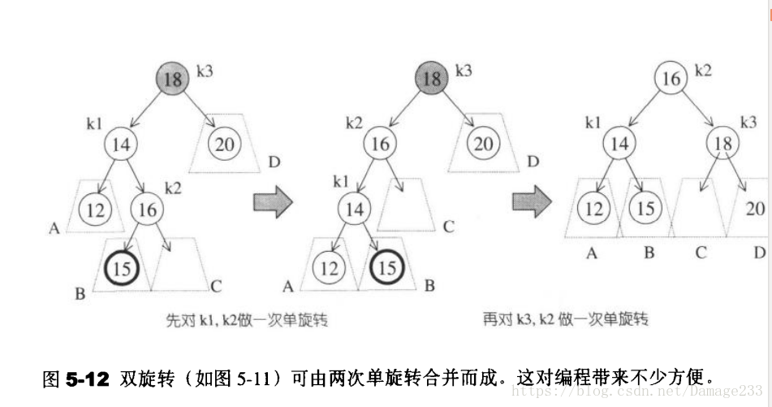
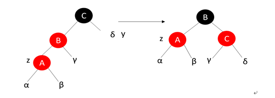
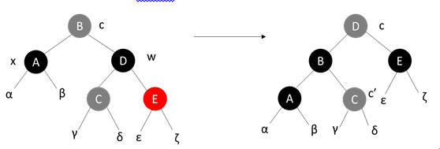

* 排序
    
  * 冒泡排序
    ```
    void BubbleSort(vector<int> &nums)
    {
        //记录位置，当前所在位置和最后发生交换的地方
        int current,last = len - 1;
        while(last > 0)
        {
            for(int i = current = 0;i < last;++i)
            {
                if(nums[i] > nums[i+1])
                {
                    int tmp = nums[i];
                    nums[i] = nums[i+1];
                    nums[i+1] = tmp;
                    //记录当前的位置，如果没有发生交换current值即for循环初始化的0
                    current = i;
                }
            }
            //若current = 0即已经没有可以交换的元素了，即已经有序了
            last = current;
        }
    }
    ```
  * 插入排序
    ```
    void InsertSort(vector<int> &nums)
    {
        for(int i = 1; i < nums.size(); ++i)
        {
            for(int j = i; j > 0; --j){
                if(nums[j] < nums[j - 1])
                {
                    int tmp = nums[j];
                    nums[j] = nums[j-1];
                    nums[j-1] = tmp;
                }
            }
        }
    }
    ```
  * 选择排序
    ```
    void SelectSort(vector<int> & nums)
    {
        int i;
        for(i = 0; i < nums.size() - 1; i++)
        {   
            int minIndex = i;
            for(int j = i; j < nums.size() - 1; j++)
                if(nums[minIndex] > nums[j])
                    minIndex = j;
        }
        swap(nums[minIndex], nums[i]);
    }
    ```
  * 归并排序
    ```
    void MergeSort(vector<int> &nums)
    {
    	vector<int> copy = nums;
	    MergeSortRecursive(nums, copy, 0, nums.size() - 1);
    }

    void MergeSortRecursive(vector<int> &nums, std::vector<int> &copy, size_t start, size_t end)
    {
	    if (start >= end) return;
	    int mid = (end - start + 1) / 2 + start;
	    MergeSortRecursive(nums, copy, start, mid - 1);
	    MergeSortRecursive(nums, copy, mid, end);
	    int start1 = start, start2 = mid, counter = start;
	    while (start1 <= mid - 1 && start2 <= end)
            nums[counter++] = copy[start1] < copy[start2] ? copy[start1++] : copy[start2++];
        while (start2 <= end)
		    nums[counter++] = copy[start2++];
	    while (start1 <= mid - 1)
            nums[counter++] = copy[start1++];
        copy = nums;
    }
    ```
  * 快速排序
    ```
    void QuickSort(vector<int> &nums)
    {
    	QuickSortRecursive(nums, 0, nums.size() - 1);
    }

    void QuickSortRecursive(vector<int> &nums, int start, int end)
    {
        if (start >= end)
            return;
        int pivot_element = nums[(rand() % (end - start + 1)) + a];
        int flag = start;
        for (int j = start; j <= end - 1; j++)
	    {
            if (nums[j] < pivot_element)
	            std::swap(nums[flag++], nums[j]);
	    }
	    std::swap(nums[flag], nums[end]);
	    QuickSortRecursive(nums, start, flag - 1);
	    QuickSortRecursive(nums, flag + 1, end);
    }
    ```
  * 桶排序
  * 堆排序  
    ```
    void adjust(vector<int> &nums, int len, int index)
    {
        int left = 2 * index + 1;
        int right = 2 * index + 2;
        int maxIdx = index;
        if (left < len && nums[left] > nums[maxIdx]) maxIdx = left;
        if (right < len && nums[right] > nums[maxIdx]) maxIdx = right;  // maxIdx是3个数中最大数的下标
        if (maxIdx != index)                 // 如果maxIdx的值有更新
        {
            swap(nums[maxIdx], nums[index]);
            adjust(nums, len, maxIdx);       // 递归调整其他不满足堆性质的部分
        }
    }

    void HeapSort(vector<int> &nums)
    {
	    for (int i = nums.size() / 2 - 1; i >= 0; i--)  // 对每一个非叶结点进行堆调整(从最后一个非叶结点开始)
        {
            adjust(nums, nums.size(), i);
        }
        for (int i = nums.size() - 1; i >= 1; i--)
        {
            swap(nums[0], nums[i]);           // 将当前最大的放置到数组末尾
            adjust(nums, i, 0);              // 将未完成排序的部分继续进行堆排序
        }
    }
    ```
* 二叉搜索树  
  定义：任何节点的键值一定大于其左子树中的每一个节点的键值，并小于其右子树中的每一个节点的键值。  
  插入：从根节点开始，遇到键值较大向右，遇到键值较小向左，直到尾端，即插入点。  
  删除：  
  1.若是叶子节点直接删除，修改父节点的指针。  
  2.若只有一个子节点，直接将其子节点连至其父节点。  
  3.若有两个子节点，以右子树中的最小值取而代之。  
* AVL树  
  定义：AVL树是一个“加上额外平衡条件”的二叉搜索树。AVL树要求任何节点的左右子树高度相差最多为1。在每个节点中需要记录自己的高度。  
  单旋转：  
    
  双旋转：  
    
* 红黑树  
  定义：  
    1.每个结点或是红色或是黑色。  
    2.根结点是黑色。  
    3.每个叶结点是黑的。  
    4.如果一个结点是红的，则它的两个儿子均是黑色。  
    5.每个结点到其叶结点的所有路径上包含相同数目的黑色结点。  
  插入：以二叉搜索树的插入方式插入一个红色节点,如果打破了红黑树的平衡调节就要进行修复,在对红黑树进行插入修复操作时，循环进入条件是当前结点的父结点为红色即性质4破坏。在修复函数中主要考虑以下三种情况。  
  **情况1：插入结点z的父结点为红色，而z的叔叔结点y是红色**  
  此时z的父结点的父结点一定存在，而且必为黑色结点，否则插入前即不是红黑树。这种情况的主要思路就是修改z的父结点和叔叔结点y的颜色为黑色，z的祖父结点的颜色修改为红色(如果是根结点的话颜色不变)，目的就是红色上移，然后当前结点指针指向祖父结点，循环进行修复操作。  
    
  **情况2：z的父结点为红色，而z的叔叔结点y是黑色，而且z是右孩子**  
  此时将当前节点的z的父结点设为新的当前节点，并以新当前节点为支点左旋。将情况2转化为情况3。  
    
  **情况3：z的父结点为红色，而z的叔叔结点y是黑色，而且z是左孩子**  
  此时将z的父节点修改为黑色，祖父节点变为红色，并以祖父节点为支点进行右旋操作。此时一行中不再有两个连续的红色结点，红黑树所有性质调整完成，因此所有的处理到此完毕。  
    
  删除：以二叉搜索树的删除方式删除一个节点，如果打破了红黑树的平衡调节就要进行修复。在对红黑树进行删除修复操作时，如果原来的黑节点被移走后替代它的是红节点那就把黑节点变为黑节点，循环进入条件是当前结点x为非根结点并且是双重黑结点(原来的黑节点被移走后替代它的还是黑节点)。分别有以下几种情况。  
  **情况1：x的兄弟结点w是红色的**  
  此时需把父结点修改成红色，把兄弟结点w修改成黑色。然后，针对父结点进行左旋操作，此时红黑树性质5不变。将情况1转化为其他情况。  
    
  **情况2：x的兄弟w是黑色的，而且w的两个孩子都是黑色的**  
  此时需从当前结点x和兄弟节点w去掉一重黑色，从而x只有一重黑色而w是红色。同时为了补偿去掉的一重黑色，需在x的父结点上增加一重黑色，并把x的父结点作为新的当前节点，重新进入循环。  
    
  **情况3：x的兄弟w是黑色的，w的左孩子是红色的，右孩子是黑色的**  
  此时需把兄弟结点w修改成红色，兄弟w的左孩子修改成黑色，然后以兄弟结点w作为支点进行右旋操作，之后重新进入算法。  
    
  **情况4：x的兄弟w是黑色的，而且w的右孩子是红色的**  
  此时需将兄弟结点w修改成x的父结点的颜色，然后将x的父结点修改成黑色，兄弟结点w的右孩子修改成黑色，然后以x的父结点为支点进行左旋操作。此时算法结束，红黑树所有性质调整完成。  
    
* B\B+树
* 哈希表
    定义：哈希表的数据由键值对组成，先通过键用哈希函数计算出索引，并根据索引在底层存储结构(一般为数组)上插入值。  
    哈希冲突：有的时候不同的键可能会计算出相同的索引，解决这种冲突有以下几种办法。  
    1.开链：在索引的位置放置一个链表，并将索引相同的值存在链表中。每次根据值查找时，先计算出索引，再在链表中搜索。
    2.线性探测：如果根据键计算出的索引为120，如果120位置已有其它的数据，便将索引值不断加1直到找到一个空位值放入数据
    3.平方探测：遇到冲突时将索引值加上1 * 1再冲突就加 -2 * 2再冲突就加3 * 3.....以此类推(n ^ 2 * (-1) ^ n + 1)  