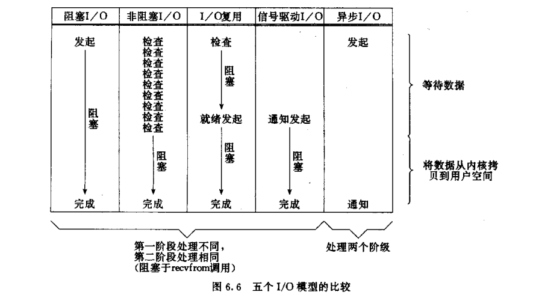
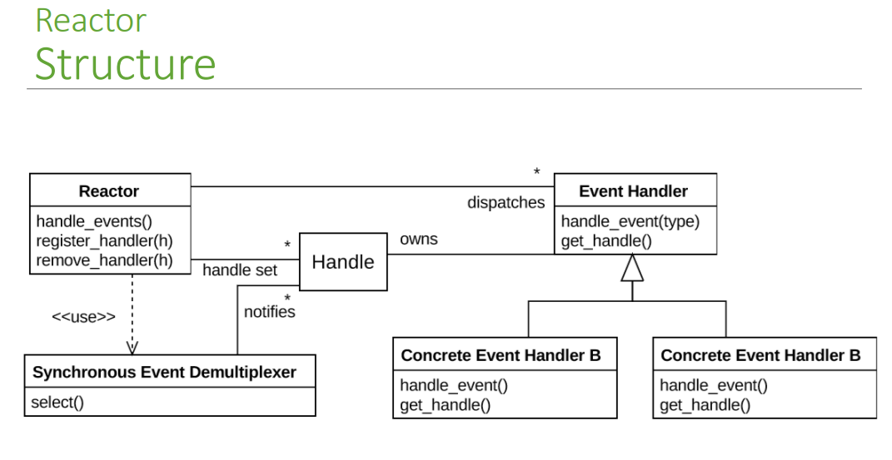

### socket流程
* 客户端
  ```
  char *ip_addr;
  int sockfd;
  sockaddr_in server_addr{};
  bzero(&server_addr， sizeof(server_addr));

  server_addr.sin_family = AF_INET;
  server_addr.sin_port = htons(PORT_NUM);
  inet_pton(AF_INET， ip_addr， &server_addr.sin_addr);

  sockfd = socket(AF_INET， SOCK_STREAM， IPPROTO_TCP);
  connect(sockfd， (struct sockaddr *) &server_addr， sizeof(server_addr));

  close(sockfd);
  ```
* 服务器端
  ```
  int listenfd;
  int connfd;
  const int PORT_NUM = 23333;
  const int LISTEN_QUEUE_SIZE = 50;
  sockaddr_in sever_addr{};
  sockaddr_in peer_addr{};
  socklen_t peer_len{};

  sever_addr.sin_family = AF_INET;
  sever_addr.sin_port = htons(PORT_NUM);
  sever_addr.sin_addr.s_addr = INADDR_ANY;

  listenfd = socket(AF_INET， SOCK_STREAM， IPPROTO_TCP);
  bind(listenfd， (sockaddr *) &sever_addr， sizeof(sever_addr));
  listen(listenfd， LISTEN_QUEUE_SIZE);
  connfd = accept(listenfd， (sockaddr *) &peer_addr， &peer_len);

  close(connfd);
  close(listenfd);
  ```
>`int socket(int domain, int type, int protocol);`  
>创建一个用以通信的端点，成功时返回一个代表该端点的文件描述符。  
>* domain参数：  
>如：AF_UNIX表示Unix域名套接字、AF_INET表示IPv4因特网协议、AF_INET6表示IPv6因特网协议。  
>* type参数：  
>如：SOCK_STREAM表示面向连接的数据流套接字、SOCK_DGRAM表示无连接的数据段套接字，用‘或’的方式开启SOCK_NONBLOCK表示非阻塞、SOCK_CLOEXEC表示close-on-exec。  
>* protocol参数：  
>如：IPPROTO_TCP表示TCP协议、IPPROTO_UDP表示UDP协议、IPROTO_ICMP表示ICMP协议。  
>
>`int connect(int sockfd, const struct sockaddr *addr, socklen_t addrlen);`  
>将sockfd指定的套接字与addr指定的地址连接起来，addrlen表示addr的长度。成功时返回0，错误时返回-1。  
>`int bind(int sockfd, const struct sockaddr *addr, socklen_t addrlen);`  
>为sockfd套接字指定一个地址。成功时返回0，错误时返回-1。  
>* 客户端需要调用bind()吗?  
>如果客户端调用bind()为套接字指定一个地址（ip：port），那么就只能以这个地址与对方进行通信，而这通常是没有必要的，因为在客户端调用connect()时操作系统会自动为套接字指定一个地址（ip：port）。如果bind()指定的地址已经被占用还会导致bind()执行错误。  
>* 服务器端为什么要bind() INADDR_ANY?  
>如果一个主机有多块网卡也就是配置了多个IP地址，想要同时监听这几个IP地址就要把bind()时的IP地址设置为INADDR_ANY。如果不这样做那么就只能监听一个特定的IP地址，而且如果其它的主机也想运行这个服务器程序就会因为IP地址的问题导致错误。  
>
>`int listen(int sockfd, int backlog);`  
>将sockfd指定的套接字转换为被动套接字，专门用来接收新的连接。backlog用来指定缓冲队列的大小，当一个新的请求到达时会被放在这个队列中等待处理，如果一个新的请求到达时队列满了，那么这个请求就会被拒绝。成功时返回0，错误时返回-1。 
>`int accept(int sockfd, struct sockaddr *addr, socklen_t *addrlen);`  
>接受sockfd指定的被动套接字的缓冲队列中的一个请求（缓冲队列解决了惊群问题），并将对方的地址存在addr中，地址长度存贮addrlen中。成功时返回一个已连接的套接字，错误时返回-1。  
### I/O模型
>  
>* 阻塞I/O  
>对套接字调用读操作后就一直阻塞在读操作中,直到数据被拷贝到用户空间。  
>* 非阻塞I/O  
>对套接字调用读操作后如果数据没有到达内核缓冲区就立刻返回,如果到达便将数据拷贝到用户空间。  
>* I/O复用  
>同时监听多个套接字,只要其中一个套接字的内核缓冲区有数据到达就发出就绪通知,然后对套接字调用读操作将数据拷贝到用户空间。  
>* 信号驱动I/O  
>当能够进行I/O操作时,内核向进程发送信号SIGIO,然后对套接字调用读操作将数据拷贝到用户空间。  
>* 异步I/O  
>对套接字调用异步读操作后立刻返回,当数据被拷贝到用户空间后向进程发出提醒。  
### select
>`int select(int nfds， fd_set *readfds， fd_set *writefds， fd_set *exceptfds， struct timeval *timeout);`  
>以I/O复用的方式监听多个文件描述符，调用前先在3个相关事件的fd_set中注册文件描述符。select返回时会在三个fd_set中存储相关事件就绪的文件描述符。失败时返回-1，超时返回0，成功时返回所有就绪的文件描述符的个数。  
>* nfds为所有select正在监听的文件描述符的最大值
>* readfds存储希望被监听read操作的文件描述符
>* writefds存储希望被监听write操作的文件描述符
>* exceptfds存储希望被监听意外情况(如带外数据)的文件描述符
>* timeout用来指定select的超时时间
>```
>struct timeval {
>    time_t      tv_sec;     /* Seconds */
>    suseconds_t tv_usec;    /* Microseconds (long int) */
>};
>```
>fd_set最大支持FD_SETSIZE个文件描述符，linux下FD_SETSIZE为1024，对fd_set的操作有以下四种：  
>`void FD_ZERO(fd_set *fdset);`  
>将fdset清空  
>`void FD_SET(int fd， fd_set *fdset);`  
>将fd加入到fdset中  
>`void FD_CLR(int fd， fd_set *fdset);`  
>将fd从fdset中删除  
>`int FD_ISSET(int fd， fd_set *fdset);`  
>如果fdset存在fd返回1，否则返回0
### poll
>`int poll(struct pollfd *fds， nfds_t nfds， int timeout);`  
>以I/O复用的方式监听多个文件描述符，调用前在struct pollfd数组中注册文件描述符与其希望被监听的事件。poll返回后会在revents中存储就绪的事件，如果要取消对某个文件描述符的监听将struct pollfd中的fd置为负数。失败时返回-1，超时返回0，成功时返回所有就绪的文件描述符的个数。  
>* fds用来存储poll监听的文件描述  
>* nfds表示fds中元素的个数  
>* timeout表示超时时间(毫秒)  
>```
>struct pollfd {
>    int fd;            /* File descriptor */
>    short events;      /* Requested events bit mask */
>    short revents;     /* Returned events bit mask */
>};
>```
>
### epoll 
>`int epoll_create(int size);`  
>创建一个epoll文件描述符,size为我们希望监听的文件描述符的个数的建议值(Linux 2.6.8之后这个参数将被忽略)。成功时返回epoll文件描述符,错误时返回-1。  
>`int epoll_ctl(int epfd， int op， int fd， struct epoll_event *event);`  
>对epfd指定的epoll文件描述符进行op指定的操作,fd为操作指定的文件描述符,event表示事件。  
>op有以下几种取值：  
>EPOLL_CTL_ADD：在epfd中注册文件描述符fd,event为所注册的事件。  
>EPOLL_CTL_MOD：在改变之前注册在epfd中的文件描述符fd所关注的事件。  
>EPOLL_CTL_DEL：将文件描述符从epfd中删除。
>```
>struct epoll_event {
>    uint32_t events;       /* epoll events (bit mask) */
>    epoll_data_t data;     /* User data */
>};
>
>typedef union epoll_data {
>    void *ptr;         /*Pointer to user-defined data */
>    int fd;            /*File descriptor */
>    uint32_t u32;      /*32-bit integer */
>    uint64_t u64;      /*64-bit integer */
>} epoll_data_t;
>```
>
>`int epoll_wait(int epfd， struct epoll_event *events， int maxevents， int timeout);`  
>以I/O复用的方式检测epfd指向的epoll文件描述符中注册的文件描述符相关事件有没有就绪,将就绪的存储在events中,maxevents表示数组events的大小,timeout表示超时的时间(毫秒)。  
>* 水平触发  
>对于读操作：只要socket对应的内核读缓冲区有数据epoll_wait()就会返回读就绪。  
>对于写操作：只要socket对应的内核写缓冲区没有满epoll_wait()就会返回写就绪。  
>* 边缘触发  
>设置events|=EPOLLET  
>对于读操作：  
>1.当缓冲区由不可读变为可读的时候，即缓冲区由空变为不空的时候。  
>2.当有新数据到达时，即缓冲区中的待读数据变多的时候。  
>对于写操作：  
>1.当buffer由不可写变为可写的时候，即由满状态变为不满状态的时候。  
>2.当有旧数据被发送走时，即buffer中待写的内容变少得时候。  
>* 惊群效应  
>比如我圈养了一群鸡，某一时刻我向鸡圈里投了一个食物（比如一条虫子），那么这个时候所有的鸡都会赶来抢这个食物，但最终只有一只鸡能够抢到，其它的鸡白跑一趟。  
>如果多个进程调用epoll_wait()监听同一个epfd当事件就绪时会有多个进程被唤醒。  
>可以在每次调用epoll_wait()前加互斥锁。  
>* 饥饿  
> 如果某个socket源源不断地收到非常多的数据，那么在试图读取完所有数据的过程中，有可能会造成其他的socket得不到处理，从而造成饥饿。解决的办法是为每个已经准备好的描述符维护一个队列，这样程序就可以知道哪些描述符已经准备好了但是还在轮询等待。  
>* epoll的实现
>当进程调用epoll_create后,内核会创建一个eventpoll结构体,里面主要包含一个红黑树用来存储需要监听的事件,和一个双向链表用来存储已经就绪的事件。每次调用epoll_ctl后,向红黑数中插入一个节点,并注册一个回调,当事件就绪后会被插入双向链表中。每次调用epoll_wait后检查双向链表是否为空,为空就阻塞,不为空就返回,并把双向链表清空。对于LT事件,如果就绪的事件没有被完成那么就再把这个事件插入双向链表,对于ET事件就不需要这样的处理。   
### I/O设计模式 
* Reactor
  >  
  >* Handle（句柄）：用来标识socket连接或是打开文件。  
  >* Synchronous Event Demultiplexer（同步事件分离器）：由操作系统内核实现的一个函数；用于阻塞等待发生在句柄集合上的一个或多个事件（如select/epoll）。
  >* Event Handler：事件处理接口,根据不同的事件执行不同的回调  
  >* Concrete Event HandlerA：实现应用程序所提供的对于特定事件的回调。  
  >* Reactor（反应器）：定义一个接口，实现以下功能：  
  1）供应用程序注册和删除事件回调与句柄。  
  2）运行事件循环。  
  3）有就绪事件到来时，分发事件到之前注册的回调函数上处理。  
  >
  >在Reactor中实现读:  
  >1. 在Reactor中注册读事件与事件回调。
  >2. 同步事件分离器等待事件。
  >3. 事件到达,分离器调用相关事件的回调。
  >4. 在回调中读取数据并处理数据。
* Proactor
  >  
  >* Handle （句柄）：用来标识socket连接或是打开文件。  
  >* Asynchronous Operation Processor（异步操作处理器）：负责执行异步操作，一般由操作系统内核实现。  
  >* Asynchronous Operation（异步操作）
  >* Completion Event Queue（完成事件队列）：异步操作完成的结果放到队列中等待后续使用。  
  >* Proactor（主动器）：为应用程序进程提供事件循环,从完成事件队列中取出异步操作的结果，分发调用相应的后续处理逻辑。  
  >* Completion Handler（完成事件接口）：一般是由回调函数组成的接口。  
  >* Concrete Completion Handler（完成事件处理逻辑)：实现接口定义特定的应用处理逻辑。
  >
  >在Proactor中实现读:  
  >1. 在Proactor中注册事件回调。
  >2. 发起异步读操作。
  >3. 异步操作处理器处理异步读操作,并将完成结果放在完成事件队列中。
  >4. Proactor从完成事件队列中取一个结果。
  >5. 异步事件分离器执行相应的回调函数。
  >6. 在回调中直接处理数据。
### I/O函数
* `ssize_t read(int fd, void *buf, size_t count);`  
  >将buf指向的缓冲区清空,如果内核缓冲区内有数据就将数据读取到缓冲区内,最多读取count长度的数据,成功时返回读取数据的个数,读到EOF返回0,错误返回-1。没有数据就阻塞在read()中。  
* `ssize_t write(int fd, const void *buf, size_t count);`  
  >将buf指向的缓冲区内的数据写入内核缓冲区,最多写入count个数据,成功时返回写入数据的个数,错误时返回-1。如果内核缓冲区已满就阻塞在write()中。
* `ssize_t readv(int fd, const struct iovec *iov, int iovcnt);`  
  ```
  struct iovec {
      void  *iov_base;    /* Starting address */
      size_t iov_len;     /* Number of bytes to transfer */
  };
  ```
  >iov为一个io向量数组,iovcnt为数组的长度,io向量中包含一个buffer和buffer的长度。readv将缓冲区内的数据依次读入io向量数组内,成功时返回读取数据的个数,读到EOF返回0,错误返回-1。  
  >相较于read,readv的buffer可以不连续,使用起来更灵活。相比与多次调用read而言,在两次read之间数据可能会被其它的进程读走。而readv具有一定的原子性,数据不会被其它进程读走。  
* `ssize_t writev(int fd, const struct iovec *iov, int iovcnt);`  
  >将长度为iovcnt的io向量数组iov中的内容依次写入缓冲区,writev同样具有一定的原子性,在写入数据时其它的进程不能向这个内核缓冲区写入数据。  
* `ssize_t recv(int sockfd, void *buf, size_t len, int flags);`  
  >与read相比多了flags参数:  
  >MSG_DONTWAIT:以非阻塞的方式执行本次操作。  
  >MSG_PEEK:读取完毕后内核缓冲区的数据不会被丢弃。  
  >MSG_WAITALL:直到读够len个数据再返回。  
  >MSG_OOB:读取带外数据。  
* `ssize_t send(int sockfd, const void *buf, size_t len, int flags);`  
  >与write相比多了flags参数:  
  >MSG_DONTWAIT:以非阻塞的方式执行本次操作。  
  >MSG_OOB:发送带外数据。  
* `ssize_t recvfrom(int sockfd, void *buf, size_t len, int flags, struct sockaddr *src_addr, socklen_t *addrlen);`  
  >与recv相比多了发送方的地址src_addr与地址长度addrlen。  
  >一般用在以UDP作为传输层协议的套接字上。  
* `ssize_t sendto(int sockfd, const void *buf, size_t len, int flags, const struct sockaddr *dest_addr, socklen_t addrlen);`  
  >与send相比多了接收方的地址dest_addr与地址长度addrlen。  
  >一般用在以UDP作为传输层协议的套接字上。  
### Socket选项  
>* SO_REUSEADDR  
>当一个ip+port地址被占用时（无论出于什么样的TCP状态）如果将这个地址在bind到其它socket上时会出现Address already in use的错误。  
>如果先绑定地址的socket处于TIME_WAIT状态并且已经设置了SO_REUSEADDR选项，后绑定地址的socket也设置了SO_REUSEADDR选项，那么第二次的绑定就能够绑定成功。  
>SO_REUSEADDR选项主要是用来跳过TIME_WAIT状态。  
>* SO_REUSEPORT  
>无论先绑定地址的socket处于什么状态只要设置了SO_REUSEPORT选项，且后绑定地址的socket也设置了SO_REUSEPORT选项，那么第二次的绑定就能够绑定成功。  
>目前的多线程网络服务器端程序为了利用多核的优势一般有如下两种架构  
>   1. 单线程listen/accept，多个工作线程接收任务分发，虽CPU的工作负载不再是问题，但会存在：  
>      单线程listener，在处理高速率海量连接时，一样会成为瓶颈      
>   2. 所有工作线程都accept()在同一个被动套接字上呢，一样存在问题：  
>      多线程访问server socket锁竞争严重  
>      高负载下，线程之间处理不均衡  
> 
>   通过SO_REUSEPORT选项可以使得每个线程中都创建一个被动套接字，并且绑定在相同的地址上。由内核自动进行负载均衡，并且减少了加锁的开销。  
### [Kiwi](https：//github.com/Xing-YuKai/Kiwi)  
---
* 服务器端工作流程  
  * 实例化EventLoop类
  * 实例化TcpServer类
  * 注册相关回调函数
  * 调用listen()
  * 调用loop() 
* 客户端工作流程
  * 实例化EventLoop类
  * 实例化TcpServer类
  * 注册相关回调函数
  * 调用connect()
  * 调用loop() 
---
* Channel类：为一个socketfd注册和取消所关注I/O事件，并负责执行回调函数。  
* Epoll类：通过poll成员函数以I/O复用的方式监听多个Channel对象，并把激活的Channels返回给EventLoop对象。  
* EventLoop类：通过loop成员函数开始循环，每次循环先调用Epoll对象的poll成员函数，然后调用激活的Channel的执行回调函数的接口，然后再执行生产者消费者队列里等待的任务。   
* EventLoopPool类：创建多个线程，每个线程中只包含一个EventLoop用来处理I/O请求
---
* 服务器端收到连接请求：  
  1. 在这之前需要先执行TcpServer类的listen成员函数，它会EventLoop对象中添加一个使TcpServer对象置于监听状态的任务。  
  2. 该任务执行后创建Accpetor对象，并把自己的Channel类成员绑定在EventLoop对象中，并对listen套接字开启EPOLLIN。  
  3. 之前在EventLoop对象中注册的Acceptor类的Channel类成员的EPOLLIN事件触发，执行回调函数。  
  4. 这个回调函数，创建一个TcpConnection对象，并向TcpServer对象中留下记录，然后向EventLoopPool类成员请求一个负责处理I/O的EventLoop，并绑定自己的Channel类成员，打开EPOLLIN，之后执行用户注册的Connection回调函数。  
* 客户端发起连接请求：  
  1. 调用TcpClient的connect成员函数，它会向EventLoop对象中添加一个任务，这个任务负责不断的向对方发出连接请求。  
  2. 成功建立连接后创建TcpConnection对象，并在EventLoop对象中绑定自己的Channel类成员，打开EPOLLIN，之后执行用户注册的Connection回调函数。  
* 收到数据：  
  1. TcpConnection类的Channel类成员的EPOLLIN事件触发，执行回调函数。  
  2. 这个回调函数，先将内核的数据读到输入Buffer当中，然后在执行用户注册的Message回调函数，处理输入Buffer中的数据。  
* 发送数据：  
  1. 调用TcpConnection类的send成员函数，将数据写入输出Buffer，打开EPOLLOUT。
  2. EPOLLOUT触发后会把输出Buffer中的数据写入内核缓冲区，全部写完后执行用户注册的WriteComplete回调函数。  
  3. 如果需要发送大文件，那么可以每次读一段数据send走，然后执行WriteComplete回调再读一段数据send走，可以把文件描述符暂存到TcpConnection对象中（暂时未实现）。  
---
1. EventLoop对象的线程安全  
   通过生产者消费者队列解决线程安全的问题，当跨线程调用时只能向生产者消费者队列中添加任务。因为EventLoop大部分时间都阻塞在poll()当中，这样一来等待的任务就没法即使执行。我们通过将一个包含eventfd的Channel注册在EventLoop当中，当向生产者消费者队列中添加任务后，便向eventfd写一个特殊整数，从而使EventLoop立刻从poll()中返回。  
2. 读写Buffer  
   用vector<char>存数据,每次写数据时把writeindex后移,每次读数据也把readindex后移,没空间写的话先看看readindex前面有没有空间,有的话就先把数据移到前面再写。  
   主要目的是简化用户的I/O逻辑。  
   * 写Buffer  
      例如先在需要写100kB的数据,但是内核缓冲区暂时只有60kB的剩余空间这时就会导致40kB,如果这个时候用户又需要写50kB的数据,那么还要把之前的40kB写入内核才能再写这50kB的数据,逻辑上比较繁琐。如果有了Buffer那么用户需要写数据时直接写入Buffer就行,网络库会负责把这些数据按顺序写入内核。
   * 读Buffer  
      例如发送方发送了一个5kB的完整数据包,但是接收方接收的数据可能是不完整的比如先到达了2kB又到达了3kB,但是无论如何必须要把这些数据从内核取走,否则会反复触发EPOLLIN造成busy-loop,但是此时因为数据不完整,用户也无法处理这些数据。如果有了读Buffer那么网络库把到达的数据按顺序存在Buffer内,用户每次从Buffer内取走一个完整数据包便可。  
3. 定时器   
   类似水表的设计方式,我们有多个级别的时间轮,一级时间轮范围为1~256tick,每格1tick,一共256个格子,二级时间轮范围为1*256~256*256tick,每格256tick,一共256个格子,一共8级时间轮。总共可以表示256^8个tick,一个tick10ms,表示的时间范围已经很够用了。添加定时器时,根据tick直接插到相应的位置,例如300tick就插到二级轮的第一格,320tick也是二级轮的第一格,256*256+10tick就插到三级轮的第一格.低级轮如果转了一圈就把高级轮前进一格,如果这个格子有定时器,就把定时器级联到低级轮里。比如一级轮转了一圈,二级轮前进了一格,这个格子里有个300tick的定时器,那么就把这个定时器的tick变为300-256=44tick,插到一级轮里面。  
   插入\删除\tick 都是O(1)的时间复杂度,但是tick的时候如果发生级联的话开销就会变大一点,这点导致tick操作没有最小堆定时器快。
---