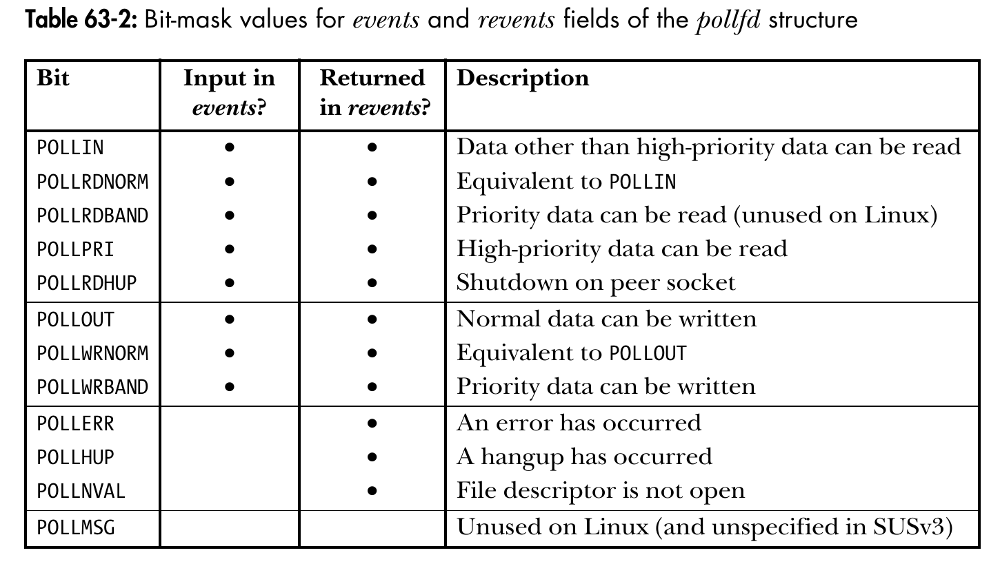

### socket流程
* 客户端
  ```
  char *ip_addr;
  int sockfd;
  sockaddr_in server_addr{};
  bzero(&server_addr， sizeof(server_addr));

  server_addr.sin_family = AF_INET;
  server_addr.sin_port = htons(PORT_NUM);
  inet_pton(AF_INET， ip_addr， &server_addr.sin_addr);

  sockfd = socket(AF_INET， SOCK_STREAM， IPPROTO_TCP);
  connect(sockfd， (struct sockaddr *) &server_addr， sizeof(server_addr));

  close(sockfd);
  ```
* 服务器端
  ```
  int listenfd;
  int connfd;
  const int PORT_NUM = 23333;
  const int LISTEN_QUEUE_SIZE = 50;
  sockaddr_in sever_addr{};
  sockaddr_in peer_addr{};
  socklen_t peer_len{};

  sever_addr.sin_family = AF_INET;
  sever_addr.sin_port = htons(PORT_NUM);
  sever_addr.sin_addr.s_addr = INADDR_ANY;

  listenfd = socket(AF_INET， SOCK_STREAM， IPPROTO_TCP);
  bind(listenfd， (sockaddr *) &sever_addr， sizeof(sever_addr));
  listen(listenfd， LISTEN_QUEUE_SIZE);
  connfd = accept(listenfd， (sockaddr *) &peer_addr， &peer_len);

  close(connfd);
  close(listenfd);
  ```
>`int socket(int domain, int type, int protocol);`  
>创建一个用以通信的端点，成功时返回一个代表该端点的文件描述符。  
>* domain参数：  
>如：AF_UNIX表示Unix域名套接字、AF_INET表示IPv4因特网协议、AF_INET6表示IPv6因特网协议。  
>* type参数：  
>如：SOCK_STREAM表示面向连接的数据流套接字、SOCK_DGRAM表示无连接的数据段套接字，用‘或’的方式开启SOCK_NONBLOCK表示非阻塞、SOCK_CLOEXEC表示close-on-exec。  
>* protocol参数：  
>如：IPPROTO_TCP表示TCP协议、IPPROTO_UDP表示UDP协议、IPROTO_ICMP表示ICMP协议。  
>
>`int connect(int sockfd, const struct sockaddr *addr, socklen_t addrlen);`  
>将sockfd指定的套接字与addr指定的地址连接起来，addrlen表示addr的长度。成功时返回0，错误时返回-1。  
>`int bind(int sockfd, const struct sockaddr *addr, socklen_t addrlen);`  
>为sockfd套接字指定一个地址。成功时返回0，错误时返回-1。  
>* 客户端需要调用bind()吗?  
>如果客户端调用bind()为套接字指定一个地址（ip:port），那么就只能以这个地址与对方进行通信，而这通常是没有必要的，因为在客户端调用connect()时操作系统会自动为套接字指定一个地址（ip:port）。如果bind()指定的地址已经被占用还会导致bind()执行错误。  
>* 服务器端为什么要bind() INADDR_ANY?  
>如果一个主机有多块网卡也就是配置了多个IP地址，想要同时监听这几个IP地址就要把bind()时的IP地址设置为INADDR_ANY。如果不这样做那么就只能监听一个特定的IP地址，而且如果其它的主机也想运行这个服务器程序就会因为IP地址的问题导致错误。  
>
>`int listen(int sockfd, int backlog);`  
>将sockfd指定的套接字转换为被动套接字，专门用来接收新的连接。backlog用来指定缓冲队列的大小，当一个新的请求到达时会被放在这个队列中等待处理，如果一个新的请求到达时队列满了，那么这个请求就会被拒绝。成功时返回0，错误时返回-1。 
>`int accept(int sockfd, struct sockaddr *addr, socklen_t *addrlen);`  
>接受sockfd指定的被动套接字的缓冲队列中的一个请求，并将对方的地址存在addr中，地址长度存贮addrlen中。成功时返回一个已连接的套接字，错误时返回-1。  
### I/O模型
>  
>
### select
>`int select(int nfds， fd_set *readfds， fd_set *writefds， fd_set *exceptfds， struct timeval *timeout);`  
>以I/O复用的方式监听多个文件描述符，调用前先在3个相关事件的fd_set中注册文件描述符。select返回时会在三个fd_set中存储相关事件就绪的文件描述符。失败时返回-1，超时返回0，成功时返回所有就绪的文件描述符的个数。  
>* nfds为所有select正在监听的文件描述符的最大值
>* readfds存储希望被监听read操作的文件描述符
>* writefds存储希望被监听write操作的文件描述符
>* exceptfds存储希望被监听意外情况(如带外数据)的文件描述符
>* timeout用来指定select的超时时间
>```
>struct timeval {
>    time_t      tv_sec;     /* Seconds */
>    suseconds_t tv_usec;    /* Microseconds (long int) */
>};
>```
>fd_set最大支持FD_SETSIZE个文件描述符，linux下FD_SETSIZE为1024，对fd_set的操作有以下四种：  
>`void FD_ZERO(fd_set *fdset);`  
>将fdset清空  
>`void FD_SET(int fd， fd_set *fdset);`  
>将fd加入到fdset中  
>`void FD_CLR(int fd， fd_set *fdset);`  
>将fd从fdset中删除  
>`int FD_ISSET(int fd， fd_set *fdset);`  
>如果fdset存在fd返回1，否则返回0
### poll
>`int poll(struct pollfd *fds， nfds_t nfds， int timeout);`  
>以I/O复用的方式监听多个文件描述符，调用前在struct pollfd数组中注册文件描述符与其希望被监听的事件。poll返回后会在revents中存储就绪的事件，如果要取消对某个文件描述符的监听将struct pollfd中的fd置为负数。失败时返回-1，超时返回0，成功时返回所有就绪的文件描述符的个数。  
>* fds用来存储poll监听的文件描述  
>* nfds表示fds中元素的个数  
>* timeout表示超时时间(毫秒)  
>```
>struct pollfd {
>    int fd;            /* File descriptor */
>    short events;      /* Requested events bit mask */
>    short revents;     /* Returned events bit mask */
>};
>```
>
### epoll 
>`int epoll_create(int size);`  
>创建一个epoll文件描述符,size为我们希望监听的文件描述符的个数的建议值(Linux 2.6.8之后这个参数将被忽略)。成功时返回epoll文件描述符,错误时返回-1。  
>`int epoll_ctl(int epfd， int op， int fd， struct epoll_event *event);`  
>对epfd指定的epoll文件描述符进行op指定的操作,fd为操作指定的文件描述符,event表示事件。  
>op有以下几种取值：  
>EPOLL_CTL_ADD：在epfd中注册文件描述符fd,event为所注册的事件。  
>EPOLL_CTL_MOD：在改变之前注册在epfd中的文件描述符fd所关注的事件。  
>EPOLL_CTL_DEL：将文件描述符从epfd中删除。
>```
>struct epoll_event {
>    uint32_t events;       /* epoll events (bit mask) */
>    epoll_data_t data;     /* User data */
>};
>
>typedef union epoll_data {
>    void *ptr;         /*Pointer to user-defined data */
>    int fd;            /*File descriptor */
>    uint32_t u32;      /*32-bit integer */
>    uint64_t u64;      /*64-bit integer */
>} epoll_data_t;
>```
>
>`int epoll_wait(int epfd， struct epoll_event *events， int maxevents， int timeout);`  
>以I/O复用的方式检测epfd指向的epoll文件描述符中注册的文件描述符相关事件有没有就绪,将就绪的存储在events中,maxevents表示数组events的大小,timeout表示超时的时间(毫秒)。  
>* 水平触发  
>对于读操作：只要socket对应的内核读缓冲区有数据epoll_wait()就会返回读就绪。  
>对于写操作：只要socket对应的内核写缓冲区没有满epoll_wait()就会返回写就绪。  
>* 边缘触发  
>设置events|=EPOLLET  
>对于读操作：
>对于写操作：
### Reactor与Proactor
### 带外数据
### [Kiwi](https://github.com/Xing-YuKai/Kiwi)  